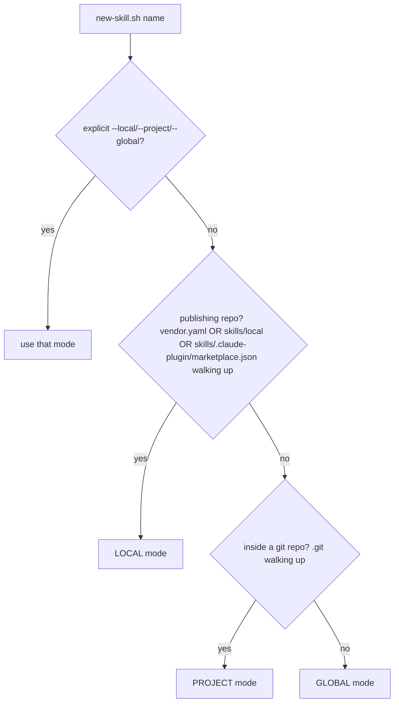

# Make `new-skill.sh` mirror `npx skills` placement

## Problem

[`skills/local/skill-author/scripts/new-skill.sh`](skills/local/skill-author/scripts/new-skill.sh) only ever writes to `<repo>/skills/local/<name>/`, hard-errors when no `skills/` dir is found walking up from CWD, and never creates the `.agents/skills` + `.claude/skills` discovery symlinks. So when someone uses `skill-author` outside this publishing repo it breaks, and even inside this repo a freshly scaffolded skill isn't discoverable by Claude/Cursor until symlinked by hand.

## Target behavior (confirmed with user)

- Engine: **pure bash, offline, no new deps** (matches repo's bash-3.2 ethos).
- Scope: **auto-detect with override flags**.

Replicate the verified `npx skills` layout: canonical content in `.agents/skills/<name>/`, with **relative** symlinks from non-universal agent dirs (`.claude/skills/<name> -> ../../.agents/skills/<name>`). "Universal" agents (cursor, codex, opencode, gemini, copilot, warp, zed, amp, cline) read `.agents/skills` directly, so they need no symlink.

## Scope resolution

- **LOCAL** (this repo's publish workflow, preserved): canonical content at `<repo>/skills/local/<name>/` (or `skills/vendor/<name>/` with `--vendor`), seeded from templates. THEN create discovery symlinks `<repo>/.agents/skills/<name>` and `<repo>/.claude/skills/<name>` -> `../../skills/local/<name>` so it's immediately usable while authoring.
- **PROJECT**: canonical at `<repo>/.agents/skills/<name>/` (seeded from templates). Symlink `<repo>/.claude/skills/<name> -> ../../.agents/skills/<name>` (and any other known non-universal agent whose config root already exists). Universal agents need nothing.
- **GLOBAL**: canonical at `~/.agents/skills/<name>/`. Symlink `~/.claude/skills/<name> -> ../../.agents/skills/<name>` (+ other detected global agent dirs).

## Symlink correctness (critical)

Per [`pitfalls/symlink-target-relative-to-symlink-not-cwd.md`](pitfalls/symlink-target-relative-to-symlink-not-cwd.md), POSIX symlinks resolve relative to the link's own directory. All target dirs here sit at a fixed 2-levels-under-base depth, so use the known-correct fixed prefix `../../` (exactly matching the existing real links like `~/.claude/skills/skill-author -> ../../.agents/skills/skill-author`). After creating each link, validate with `test -e "<link>/SKILL.md"` and fail loudly (a dangling link looks green in `ls`/`git status`).

## Files to change

- **`skills/local/skill-author/scripts/new-skill.sh`** — main rewrite:
  - Add scope detection (`is_publishing_repo`, `find_git_root`) + flags `--local` / `--project` / `--global` (keep `--vendor`, `--root`, `--dry-run`, `--force`, `--help`).
  - Factor placement into: pick canonical dir per mode -> seed templates (existing `write_template`/`substitute` logic) -> `link_into <agent-skills-dir>` helper that makes a validated relative symlink.
  - Small extensible table of non-universal agents to fan out to (claude-code always; others only if their config root dir already exists, mirroring upstream's "don't create `.windsurf/` unless present").
  - Update `usage()` and the structured JSON success output to report `mode`, `canonical`, and `symlinks[]`.
- **`skills/local/skill-author/SKILL.md`** — update step 2 "Scaffold", the "Available scripts" bullet (new flags/modes), and Gotchas (scope auto-detect + symlink relativity). Add a line telling the agent to **ask the user "system-wide or project-wide?"** when scope is ambiguous, since the script is non-interactive.
- **`skills/local/skill-author/references/this-repo-conventions.md`** — fix the now-stale "legacy `.agents/skills/` ... Don't add new skills under it" note (it's an active discovery-symlink farm) and document the three scopes.
- **`docs/workflows/creating-local-skills.md`** + **`.zh-TW.md`** — present `new-skill.sh` (with modes) alongside `npx skills init`.
- **`docs/reference/scripts.md`** + **`.zh-TW.md`** — refresh new-skill.sh flag/behavior docs.
- **`README.md`** — tweak the "Adding a new local skill" snippet.
- **`pitfalls/symlink-target-relative-to-symlink-not-cwd.md`** — append a short "now enforced by new-skill.sh" prevention note.

## Validation

- `bash skills/local/skill-author/scripts/lint-skill.sh skills/local/skill-author` (script must keep its `--help` handler + shebang + executable bit).
- `--dry-run` smoke across all three scopes; confirm in a `/tmp` scratch dir that PROJECT/GLOBAL produce a working `.claude/skills/<name>/SKILL.md` via the symlink (`test -e`), and that LOCAL still lands in `skills/local/<name>/` plus valid discovery links.
- Confirm bash 3.2 safety (no `mapfile`, no `${var,,}`, no `[[ -v ]]`).