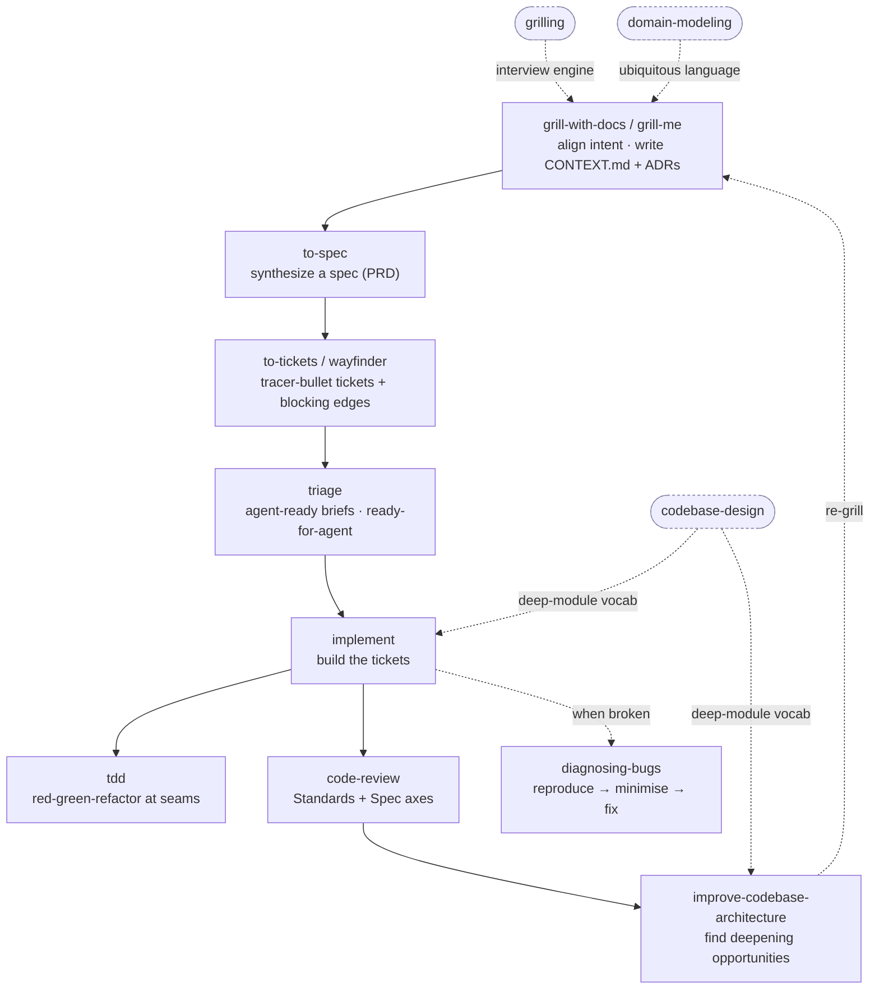

# Matt Pocock's "Skills for Real Engineers"

[Matt Pocock](https://github.com/mattpocock) — the TypeScript educator behind
[Total TypeScript](https://www.totaltypescript.com/) — publishes
[`mattpocock/skills`](https://github.com/mattpocock/skills), a collection he
describes as *"agent skills that I use every day to do real engineering — not
vibe coding."* They are **small, composable, model-agnostic** markdown skills
"based on decades of engineering experience."

The pitch is not "here is a big skill that does everything." It is a **flow**:
each skill is one disciplined step, and the steps chain into a repeatable loop
from a rough idea to reviewed, tested, committed code. His walkthrough video,
[*"mattpocock/skills: Learn the whole flow, end-to-end"*](https://youtu.be/M6mYodf0dJM),
is the best introduction to how the pieces fit together.

This page documents the slice of that collection we vendor into the
[`engineering-fundamentals`](../skills/index.md) series, the end-to-end flow it
supports, and what we deliberately leave upstream.

## The end-to-end flow

The skills are designed to hand off to one another. The backbone runs
**align → specify → slice → implement → review**, with a few disciplines
(`grilling`, `domain-modeling`, `codebase-design`) supplying the shared
vocabulary the other skills reuse, and `diagnosing-bugs` on the "something
broke" branch.



The engineering payoff Matt targets, step by step:

- **Alignment first.** `grill-me` / `grill-with-docs` interview you until every
  branch of a decision is resolved, and capture the shared language in a
  `CONTEXT.md` glossary + ADRs. `grilling` is the reusable interview loop behind
  both; `domain-modeling` maintains the ubiquitous language. This is what stops
  an agent from confidently building the wrong thing.
- **A durable spec, then slices.** `to-spec` turns the aligned conversation into
  a spec (you may know it as a PRD) on the issue tracker. `to-tickets` breaks it
  into **tracer-bullet vertical slices** — each a narrow-but-complete path through
  every layer, sized for one context window — with explicit **blocking edges**.
  `wayfinder` is the same idea scaled past a single agent session: a map of
  investigation tickets resolved one at a time.
- **Tight feedback loops.** `implement` drives `/tdd` (red-green-refactor at
  pre-agreed seams) and finishes with `/code-review` before committing.
  `code-review` runs two parallel sub-agents — **Standards** (does it follow the
  repo's documented conventions?) and **Spec** (does it match what the issue
  asked for?).
- **Design care over time.** `codebase-design` supplies the deep-module
  vocabulary (module, interface, depth, seam, adapter); `improve-codebase-architecture`
  scans for deepening opportunities and grills through the one you pick.
  `diagnosing-bugs` is the disciplined loop for when something is broken or slow.

## Why `mattpocock/skills` is installable here

The repo is **MIT-licensed** and the skills are plain
[agentskills.io](https://agentskills.io/specification)-spec markdown, so they run
in any compliant agent — Claude Code, Codex, OpenCode, Cursor, Gemini CLI. Matt's
own `.claude` layout is just one host; vendoring the markdown into this repo is
safe and portable.

## Skills we vendor (15, series `engineering-fundamentals`)

We vendor the whole core flow so it is **self-consistent** — every `/skill`
cross-reference resolves within the series (the two exceptions are documented
below). `disable-model-invocation: true` skills are **user-invoked** (you call
them explicitly); the rest are **model-invoked** disciplines an agent reaches for
when appropriate.

### Orchestrators (user-invoked)

| Skill | Upstream bucket | What it does |
|---|---|---|
| `grill-with-docs` | `engineering/` | Relentless interview that also writes ADRs + a glossary as you go. |
| `to-spec` | `engineering/` | Synthesize the current conversation into a spec/PRD and publish it — no interview. |
| `to-tickets` | `engineering/` | Break a plan/spec into tracer-bullet tickets, each declaring its blocking edges. |
| `wayfinder` | `engineering/` | Plan work bigger than one agent session as a shared map of decision tickets, resolved one at a time. |
| `implement` | `engineering/` | Build the work from a spec or tickets, driving `/tdd` and finishing with `/code-review`. |
| `improve-codebase-architecture` | `engineering/` | Scan for deepening opportunities, present a visual HTML report, then grill the one you pick. |
| `zoom-out` | `engineering/` (frozen) | Step back for broader, higher-level context on unfamiliar code. **Frozen** — deleted upstream in the 2026-07 reorg; we keep the last-synced copy. |

### Disciplines (model-invoked)

| Skill | Upstream bucket | What it does |
|---|---|---|
| `grilling` | `productivity/` | The reusable interview loop that grills until every branch of a decision is resolved (engine behind `grill-with-docs`/`grill-me`). |
| `domain-modeling` | `engineering/` | Build and sharpen the project's ubiquitous language; maintain the domain model + ADRs. |
| `codebase-design` | `engineering/` | Shared vocabulary for designing deep modules — module, interface, depth, seam, adapter. |
| `tdd` | `engineering/` | Test-driven red-green-refactor loop at pre-agreed seams. |
| `code-review` | `engineering/` | Two-axis review (Standards + Spec) run as parallel sub-agents against a fixed base point. |
| `diagnosing-bugs` | `engineering/` | Diagnosis loop for hard bugs and performance regressions (reproduce → minimise → hypothesise → fix → regression-test). |
| `triage` | `engineering/` | Move issues and external PRs through a triage state machine, writing agent-ready briefs. |
| `prototype` | `engineering/` | Build a throwaway prototype to answer a design question. |

## Prerequisite: `/setup-matt-pocock-skills`

Several flow skills (`to-spec`, `to-tickets`, `triage`, `code-review`,
`wayfinder`) expect an **issue tracker + triage-label vocabulary + docs
location** to have been configured. Upstream that is done once per repo by the
`setup-matt-pocock-skills` skill, which we do **not** vendor — it is an
opinionated repo bootstrap (it writes `docs/agents/issue-tracker.md`, label
mappings, etc.). The dependency is **soft**: each skill says *"run
`/setup-matt-pocock-skills` if not provided"* and otherwise **defaults to a
local-markdown tracker**, so the flow still works without it. To adopt the full
tracker-backed workflow, install and run `setup-matt-pocock-skills` from upstream
(see [Install](#install)). It is the top candidate in the
[remaining-skills TODO](#upstream-skills-we-dont-vendor-yet).

## Upstream skills we don't vendor (yet)

`mattpocock/skills` is far larger than the core flow. We cherry-pick per the
repo's [vendoring policy](../catalog/skill-collections.md#vendoring-policy) and
leave the rest for manual install. Two vendored skills still reference an
un-vendored skill, by design:

- **`wayfinder` → `/research`** — `wayfinder` fires `/research` sub-agents to
  resolve investigation tickets. We ship the
  [`deep-research`](../skills/index.md) skill (a different upstream) which can
  play that role, and `research` itself is a [TODO](#upstream-skills-we-dont-vendor-yet) candidate.
- **flow → `/setup-matt-pocock-skills`** — soft, see [above](#prerequisite-setup-matt-pocock-skills).

Deliberately left upstream (tracked in
[`TODO.md`](https://github.com/daviddwlee84/agent-skills/blob/main/TODO.md)):

| Upstream skill | Bucket | Why not vendored |
|---|---|---|
| `setup-matt-pocock-skills` | `engineering/` | Opinionated per-repo bootstrap; soft prereq documented above. |
| `ask-matt` | `engineering/` | Router over Matt's own skill set — redundant once you know the flow. |
| `research` | `engineering/` | Overlaps the vendored `deep-research`; evaluate before adding. |
| `resolving-merge-conflicts` | `engineering/` | Candidate; overlaps the local `git-workflow` scope. |
| `grill-me` | `productivity/` | User-facing wrapper of `grilling` (which we vendor). |
| `handoff`, `teach` | `productivity/` | Niche productivity workflows, not part of the build loop. |
| `writing-great-skills` | `productivity/` | Duplicates the local [`skill-author`](../skills/skill-author.md). |
| `misc/*` | `misc/` | `git-guardrails-claude-code`, `setup-pre-commit`, `migrate-to-shoehorn`, `scaffold-exercises` — narrow / host-specific. |
| `deprecated/*`, `in-progress/*`, `personal/*` | — | Upstream marks these unstable or personal; skipped wholesale. |

## The 2026-07 reorg

Our first sync (2026-07-05) tracked a flat `skills/engineering/` layout. Matt has
since restructured into `engineering/`, `productivity/`, `misc/`, `deprecated/`,
`in-progress/`, and `personal/` buckets, which changed two of our entries and
removed one. Our `vendor.yaml` bookkeeping records the lineage:

- `to-prd` → **`to-spec`** (`renamed_from: to-prd`) — PRD framing became "spec".
- `to-issues` → **`to-tickets`** (`renamed_from: to-issues`) — now tracer-bullet tickets.
- `zoom-out` — **deleted upstream**, kept locally via a `frozen:` block.
- `diagnose` → **`diagnosing-bugs`** (`renamed_from: diagnose`) — from the earlier reorg.

Renaming changes the **downstream install id** (`npx skills` has no lockfile), so
`renamed_from:` is how we keep the history greppable. See
[Adding vendor skills → renamed/removed upstream](../workflows/adding-vendor-skills.md)
and `CLAUDE.md`.

!!! note "`code-review` name overlap"
    We vendor a skill named `code-review`. It is Matt's two-axis (Standards + Spec)
    review discipline — distinct from Claude Code's built-in `/code-review`
    command. Both can coexist; invoke the vendored one by its skill name.

## Install

```bash
# The 15-skill flow, via this repo (grouped as "engineering-fundamentals")
npx skills@latest add daviddwlee84/agent-skills

# The full upstream collection (all buckets), straight from Matt
npx skills@latest add mattpocock/skills
# …then run /setup-matt-pocock-skills once to wire up your issue tracker.

# Or as a Claude Code plugin (managed, read-only, auto-updating)
claude plugin marketplace add mattpocock/skills
claude plugin install mattpocock-skills@mattpocock
```

The `npx skills` install copies editable markdown into your project (hack away);
the plugin install is a managed bundle that updates when Matt ships new versions.

## See also

- [External skill collections](../catalog/skill-collections.md#general-purpose-collections)
  — the catalog row for `mattpocock/skills` links back here.
- [Agent Harness domain hub](../catalog/domains/agent-harness.md) — where
  spec-driven flows and harnesses are surveyed.
- [Warp Oz skills](warp-oz-skills.md) — its GitHub-specific `triage`/PR skills
  complement Matt's more general-purpose `triage`.
- [Deep Research landscape](deep-research-landscape.md) — the `deep-research`
  skill that can stand in for `wayfinder`'s `/research` sub-agents.
