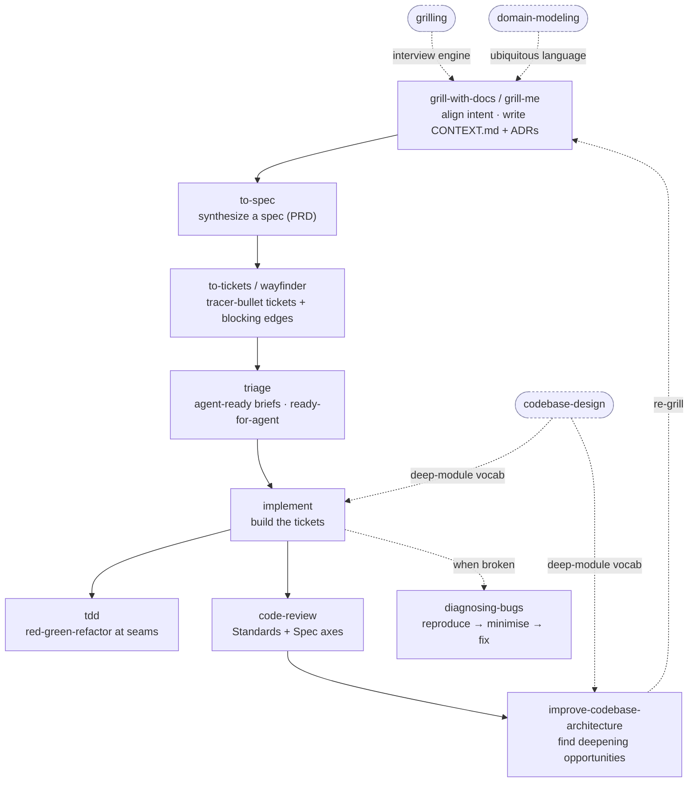

# Matt Pocock 的「Skills for Real Engineers」

!!! note "Terminology rule (zh-TW pages)"
    技術名詞首次出現以「中文 (English original)」格式呈現。**不自創翻譯**——
    若無公認譯名直接保留英文（如 `SKILL.md`、`CONTEXT.md`、`ADR`、`PRD`、`gh`）。
    代碼、API 名、CLI flag、套件名、檔名一律不翻。

[Matt Pocock](https://github.com/mattpocock)——[Total TypeScript](https://www.totaltypescript.com/)
背後、知名的 TypeScript 教育者——維護
[`mattpocock/skills`](https://github.com/mattpocock/skills)，他形容這是一組
*「我每天用來做 real engineering（真正的工程）、而不是 vibe coding 的 agent
skills」*。它們是**小巧、可組合、與模型無關（model-agnostic）**的 markdown
skill，「based on decades of engineering experience（建立在數十年工程經驗之上）」。

它的賣點不是「一個什麼都做的大 skill」，而是一條**流程（flow）**：每個 skill
都是一個有紀律的步驟，這些步驟串成一個可重複的迴圈——從一個粗略的想法，到經過
review、測試、commit 的程式碼。他的導覽影片
[*「mattpocock/skills: Learn the whole flow, end-to-end」*](https://youtu.be/M6mYodf0dJM)
是理解各部分如何組合起來的最佳入門。

本頁記錄我們 vendor 進
[`engineering-fundamentals`](../skills/index.md) series 的那一部分、它所支撐的
end-to-end 流程，以及我們刻意留在上游的部分。

## End-to-end 流程

這些 skill 設計成彼此交棒。主幹是
**對齊（align）→ 規格化（specify）→ 切片（slice）→ 實作（implement）→ 審查（review）**，
另外有幾個「紀律型（discipline）」skill（`grilling`、`domain-modeling`、
`codebase-design`）提供其他 skill 共用的詞彙，而 `diagnosing-bugs` 位在「出問題了」
的分支上。



Matt 想達成的工程效益，逐步來看：

- **先對齊。** `grill-me` / `grill-with-docs` 會不斷質問（interview）你，直到一個
  決策的每個分支都被解決，並把共用語言記進 `CONTEXT.md` 詞彙表（glossary）+
  ADR。`grilling` 是這兩者背後可重用的質問迴圈；`domain-modeling` 維護
  ubiquitous language（通用語言）。這正是防止 agent 自信地做錯東西的關鍵。
- **先產出可留存的 spec，再切片。** `to-spec` 把已對齊的對話變成一份 spec（你可能
  稱它為 PRD）放上 issue tracker。`to-tickets` 把它拆成**tracer-bullet 垂直切片
  （vertical slice）**——每片都是穿過所有層、窄但完整的路徑，大小剛好塞進一個
  context window——並標明**blocking edges（阻擋邊）**。`wayfinder` 是同樣概念放大到
  超過單一 agent session 的規模：一張逐一解決的調查（investigation）ticket 地圖。
- **緊湊的回饋迴圈。** `implement` 會驅動 `/tdd`（在事先約定的 seam 上做
  red-green-refactor）並在 commit 前以 `/code-review` 收尾。`code-review` 跑兩個
  平行 sub-agent——**Standards**（是否遵循 repo 記載的慣例？）與 **Spec**（是否符合
  originating issue 的要求？）。
- **長期的設計照顧。** `codebase-design` 提供 deep-module 詞彙（module、interface、
  depth、seam、adapter）；`improve-codebase-architecture` 掃描可「加深」的機會，並
  對你選定的那個進行 grilling。`diagnosing-bugs` 則是東西壞掉或變慢時有紀律的迴圈。

## 為什麼 `mattpocock/skills` 可以 vendor 進來

這個 repo 是 **MIT 授權**，skill 都是純
[agentskills.io](https://agentskills.io/specification) 規格的 markdown，因此能在
任何相容 agent 上運作——Claude Code、Codex、OpenCode、Cursor、Gemini CLI。Matt
自己的 `.claude` 佈局只是其中一個 host；把 markdown vendor 進本 repo 既安全又可攜。

## 我們 vendor 的 skill（15 個，series `engineering-fundamentals`）

我們把整條核心流程都 vendor 進來，讓它**自洽（self-consistent）**——每個
`/skill` 交叉引用都能在 series 內解析（兩個例外於下方記錄）。標記
`disable-model-invocation: true` 的是 **user-invoked（由你明確呼叫）**；其餘是
**model-invoked（agent 視情況取用）**的紀律型 skill。

### 編排型 / Orchestrators（user-invoked）

| Skill | 上游 bucket | 功能 |
|---|---|---|
| `grill-with-docs` | `engineering/` | 不留情的質問，過程中同時寫下 ADR + 詞彙表。 |
| `to-spec` | `engineering/` | 把當前對話綜合成一份 spec/PRD 並發佈——不做 interview。 |
| `to-tickets` | `engineering/` | 把 plan/spec 拆成 tracer-bullet ticket，各自標明 blocking edges。 |
| `wayfinder` | `engineering/` | 把大於一個 agent session 的工作規劃成一張共享的決策 ticket 地圖，逐一解決。 |
| `implement` | `engineering/` | 依 spec 或 ticket 實作，驅動 `/tdd`，並以 `/code-review` 收尾。 |
| `improve-codebase-architecture` | `engineering/` | 掃描可加深的機會，以視覺化 HTML 報告呈現，再對你選的那個做 grilling。 |
| `zoom-out` | `engineering/`（frozen） | 退一步取得更宏觀、更高層的脈絡。**已凍結**——在 2026-07 reorg 中被上游刪除，我們保留最後一次同步的副本。 |

### 紀律型 / Disciplines（model-invoked）

| Skill | 上游 bucket | 功能 |
|---|---|---|
| `grilling` | `productivity/` | 可重用的質問迴圈，不斷追問直到決策每個分支都解決（`grill-with-docs`/`grill-me` 的引擎）。 |
| `domain-modeling` | `engineering/` | 建立並打磨專案的 ubiquitous language；維護 domain model + ADR。 |
| `codebase-design` | `engineering/` | 設計 deep module 的共用詞彙——module、interface、depth、seam、adapter。 |
| `tdd` | `engineering/` | 在事先約定的 seam 上做 test-driven red-green-refactor 迴圈。 |
| `code-review` | `engineering/` | 針對固定基準點，以平行 sub-agent 跑兩軸審查（Standards + Spec）。 |
| `diagnosing-bugs` | `engineering/` | 針對難纏 bug 與效能退化的診斷迴圈（重現 → 縮小 → 假設 → 修復 → 回歸測試）。 |
| `triage` | `engineering/` | 讓 issue 與外部 PR 走過一個 triage 狀態機，並寫出 agent-ready 的 brief。 |
| `prototype` | `engineering/` | 做一個用完即丟的原型來回答某個設計問題。 |

## 前置需求：`/setup-matt-pocock-skills` { #prerequisite-setup-matt-pocock-skills }

有幾個流程 skill（`to-spec`、`to-tickets`、`triage`、`code-review`、`wayfinder`）
預期已經設定好 **issue tracker + triage 標籤詞彙 + 文件位置**。在上游，這是由
`setup-matt-pocock-skills` skill 每個 repo 做一次的，而我們**不**把它 vendor 進來
——它是一個帶主觀立場的 repo bootstrap（會寫 `docs/agents/issue-tracker.md`、
標籤對應等）。這個相依是**軟性（soft）**的：每個 skill 都說*「run
`/setup-matt-pocock-skills` if not provided」*，否則**預設退回本地 markdown
tracker**，所以流程沒有它也能運作。若要採用完整、以 tracker 為後盾的工作流，請從
上游安裝並執行 `setup-matt-pocock-skills`（見 [安裝](#install)）。它是
[剩餘 skill 的 TODO](#upstream-skills-we-dont-vendor-yet) 中的首要候選。

## 我們暫時不 vendor 的上游 skill { #upstream-skills-we-dont-vendor-yet }

`mattpocock/skills` 遠比核心流程龐大。我們依本 repo 的
[vendoring policy](../catalog/skill-collections.md) 挑選，其餘留給
手動安裝。有兩個已 vendor 的 skill 仍刻意引用了未 vendor 的 skill：

- **`wayfinder` → `/research`**——`wayfinder` 會啟動 `/research` sub-agent 來解決
  調查 ticket。我們有 vendor [`deep-research`](../skills/index.md) skill（來自不同
  上游）可扮演這個角色，而 `research` 本身是一個 [TODO](#upstream-skills-we-dont-vendor-yet) 候選。
- **flow → `/setup-matt-pocock-skills`**——軟性相依，見[上方](#prerequisite-setup-matt-pocock-skills)。

刻意留在上游的（記錄於
[`TODO.md`](https://github.com/daviddwlee84/agent-skills/blob/main/TODO.md)）：

| 上游 skill | Bucket | 為何不 vendor |
|---|---|---|
| `setup-matt-pocock-skills` | `engineering/` | 帶主觀立場的每 repo bootstrap；上方已說明的軟性前置。 |
| `ask-matt` | `engineering/` | 對 Matt 自家 skill 集合的 router——熟悉流程後即多餘。 |
| `research` | `engineering/` | 與已 vendor 的 `deep-research` 重疊；加入前先評估。 |
| `resolving-merge-conflicts` | `engineering/` | 候選；與本地 `git-workflow` 範圍重疊。 |
| `grill-me` | `productivity/` | `grilling`（我們有 vendor）的使用者端包裝。 |
| `handoff`、`teach` | `productivity/` | 較利基的 productivity 工作流，不屬於 build 迴圈。 |
| `writing-great-skills` | `productivity/` | 與本地 [`skill-author`](../skills/skill-author.md) 重複。 |
| `misc/*` | `misc/` | `git-guardrails-claude-code`、`setup-pre-commit`、`migrate-to-shoehorn`、`scaffold-exercises`——太窄／依賴特定 host。 |
| `deprecated/*`、`in-progress/*`、`personal/*` | — | 上游標記為不穩定或個人用；整批略過。 |

## 2026-07 的 reorg

我們第一次同步（2026-07-05）追蹤的是扁平的 `skills/engineering/` 佈局。Matt 之後把
它重組成 `engineering/`、`productivity/`、`misc/`、`deprecated/`、`in-progress/`、
`personal/` 這些 bucket，因而改動了我們兩個條目、移除一個。我們的 `vendor.yaml`
以下列 bookkeeping 記錄血緣：

- `to-prd` → **`to-spec`**（`renamed_from: to-prd`）——PRD 框架變成「spec」。
- `to-issues` → **`to-tickets`**（`renamed_from: to-issues`）——現在是 tracer-bullet ticket。
- `zoom-out`——**被上游刪除**，透過 `frozen:` 區塊保留在本地。
- `diagnose` → **`diagnosing-bugs`**（`renamed_from: diagnose`）——來自更早的 reorg。

改名會改變**下游 install id**（`npx skills` 沒有 lockfile），所以 `renamed_from:`
是我們讓歷史可 grep 的方式。見
[Adding vendor skills → renamed/removed upstream](../workflows/adding-vendor-skills.md)
與 `CLAUDE.md`。

!!! note "`code-review` 名稱重疊"
    我們 vendor 了一個叫 `code-review` 的 skill。它是 Matt 的兩軸（Standards +
    Spec）審查紀律——與 Claude Code 內建的 `/code-review` 指令不同。兩者可共存；
    要用 vendor 進來的那個，就以它的 skill 名稱呼叫。

## 安裝 { #install }

```bash
# 這 15 個 skill 的流程，透過本 repo（歸在 "engineering-fundamentals" 群組）
npx skills@latest add daviddwlee84/agent-skills

# 完整的上游集合（所有 bucket），直接來自 Matt
npx skills@latest add mattpocock/skills
# …接著執行一次 /setup-matt-pocock-skills 來接上你的 issue tracker。

# 或作為 Claude Code plugin（受管、唯讀、自動更新）
claude plugin marketplace add mattpocock/skills
claude plugin install mattpocock-skills@mattpocock
```

`npx skills` 安裝會把可編輯的 markdown 複製進你的專案（隨你改）；plugin 安裝則是
受管的 bundle，會在 Matt 發佈新版本時更新。

## 延伸閱讀

- [External skill collections](../catalog/skill-collections.md)
  ——`mattpocock/skills` 的 catalog 條目會連回本頁。
- [Agent Harness domain hub](../catalog/domains/agent-harness.md)——綜覽
  spec-driven 流程與 harness 的地方。
- [Warp Oz skills](warp-oz-skills.md)——它針對 GitHub 的 `triage`／PR skill 與
  Matt 較通用的 `triage` 互補。
- [Deep Research landscape](deep-research-landscape.md)——可頂替 `wayfinder` 的
  `/research` sub-agent 的 `deep-research` skill。
