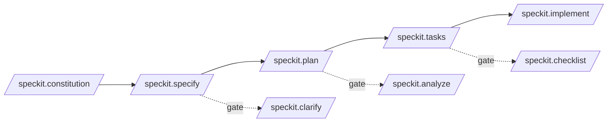
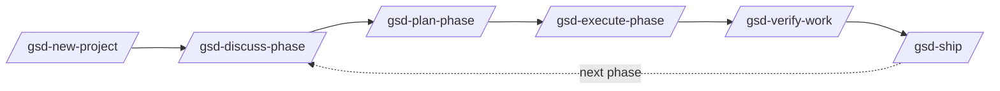
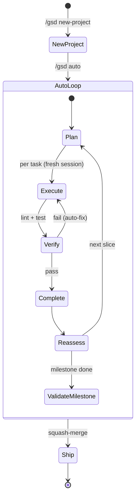
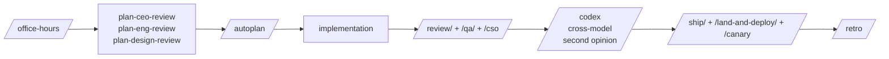
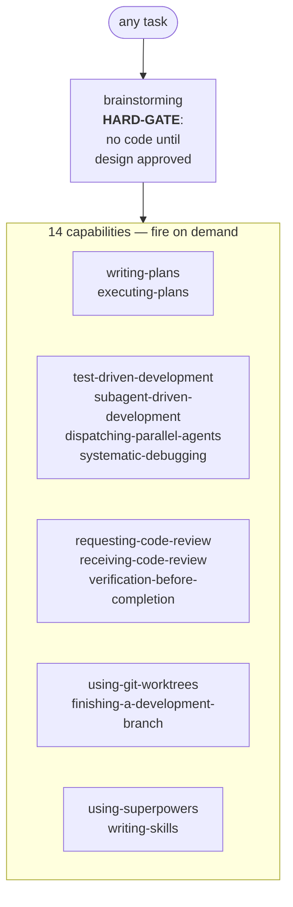
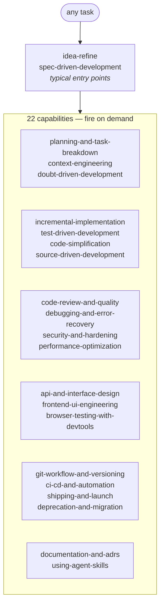

# Spec-Driven Development frameworks & agent harnesses

This page surveys the popular **spec-driven development (SDD)** frameworks
and **agent harnesses** that sit *one layer above* agent skills, and records
where this repo intentionally does not compete with them.

## The layering

Three things often get conflated. They are not the same:

| Layer | What it is | Examples |
|---|---|---|
| **Skill** | A small `SKILL.md` (+ optional `references/`, `scripts/`) the agent loads on demand. Stateless prompt fragment. Governed by the [Agent Skills spec](https://agentskills.io/specification). | This repo's skills, `mattpocock/skills`, `anthropics/skills`, `gstack` skills |
| **SDD framework** | A workflow that owns the loop *requirements → spec → plan → tasks → execute → verify*, usually via slash commands and structured artifacts. Stateful (writes spec/plan/task files into the repo). | [`github/spec-kit`](https://github.com/github/spec-kit), [`gsd-build/get-shit-done`](https://github.com/gsd-build/get-shit-done) |
| **Agent harness** | A standalone CLI/runtime that *controls* the agent session — context windows, fresh subagents, git worktrees, crash recovery, cost tracking. Replaces or wraps the agent. | [`gsd-build/gsd-2`](https://github.com/gsd-build/gsd-2), [OpenClaw](https://github.com/openclaw/openclaw), [Pi SDK](https://github.com/badlogic/pi-mono) |

Skills are *consumed* by harnesses and SDD frameworks. They are not a
substitute for either. This repo focuses on **skills**, and explicitly does
not ship a SDD framework or harness.

## Surveyed projects

### `github/spec-kit` (95.5k ⭐) — the SDD reference implementation

The de facto SDD framework, maintained by GitHub. Installs a Python CLI
(`specify`) plus a set of slash commands that write spec/plan/task artifacts
into your repo:

| Command | What it produces |
|---|---|
| `/speckit.constitution` | `.specify/memory/` — project governing principles |
| `/speckit.specify` | Feature spec (the *what* and *why*, not the stack) |
| `/speckit.plan` | Technical implementation plan (the *how*) |
| `/speckit.tasks` | Actionable task list |
| `/speckit.implement` | Execute tasks |
| `/speckit.clarify`, `/speckit.analyze`, `/speckit.checklist` | Optional quality gates |

Key properties:

- **Open ecosystem** — 80+ community extensions in [the catalog](https://github.com/github/spec-kit/blob/main/extensions/catalog.community.json)
  (Jira/Linear sync, security review, V-Model, brownfield bootstrap, retro,
  etc.) plus presets that override templates without touching tooling.
- **30+ supported agents** — Claude Code, Codex, Cursor, Copilot, Windsurf,
  Gemini CLI, Kilo, etc.
- **Skills mode** — `--integration <agent> --integration-options="--skills"`
  installs the slash commands as agent skills (`speckit-constitution`,
  `speckit-plan`, …) instead of slash-command files.
- **Stateless** — spec-kit itself doesn't manage agent sessions; it just
  writes prompt files and lets your agent execute.

### `gsd-build/get-shit-done` (61.4k ⭐) — opinionated SDD for solo builders

Earlier, lighter take on the same idea, by TÂCHES. Six-command loop:

```
/gsd-new-project → /gsd-discuss-phase → /gsd-plan-phase
  → /gsd-execute-phase → /gsd-verify-work → /gsd-ship
```

Differentiators vs spec-kit:

- **Fewer ceremonies** — explicitly built for solo devs, not 50-person eng
  orgs. No story points, no sprint syncs.
- **Subagent orchestration baked in** — execute runs plans in *parallel
  waves*, each in its own fresh 200k-token context.
- **Persistent artifacts** — `PROJECT.md` / `REQUIREMENTS.md` /
  `ROADMAP.md` / `STATE.md` / `CONTEXT.md` survive session boundaries so
  every fresh agent loads the same memory.
- Still a **prompt framework** — relies on the LLM following the prompts,
  no direct control over context or session lifecycle.

### `gsd-build/gsd-2` (7.3k ⭐) — GSD as a real harness

The successor that admits the prompt-framework approach has hard limits
(no context control, no crash recovery, no real automation) and rebuilds
GSD as a **standalone TypeScript CLI** on top of the [Pi SDK](https://github.com/badlogic/pi-mono).
Now an actual *agent harness*:

| v1 (prompt framework) | v2 (agent harness) |
|---|---|
| Slash commands inside Claude Code | Standalone CLI |
| Hope the LLM doesn't fill its context | Fresh session per task, programmatic |
| LLM self-loop "auto mode" | State-machine over SQLite database |
| No crash recovery | Lock files + session forensics + DB-backed runtime state |
| LLM writes git commands | Worktree isolation, sequential commits, squash merge |
| No cost/token tracking | Per-unit ledger + dashboard + budget ceilings |
| No stuck detection | Sliding-window dispatch detector + bounded retries |

Hierarchy: **Milestone → Slice → Task** with an iron rule that *a task must
fit in one context window*. `/gsd auto` runs the loop unattended until the
milestone is done.

This is the same architectural class as OpenClaw and the gstack browser
stack — code that *runs around* the agent rather than *inside* it.

### `Chen-Dixi/nano-bruce/specs` — minimal SDD pattern in the wild

A small working example showing how lightweight SDD can be:

```
specs/
├── mission.md
├── roadmap.md
├── tech-stack.md
├── 2026-04-24-configuration-system/
├── 2026-04-24-session-management/
└── 2026-05-03-terminal-ui/
```

Just three repo-level docs (mission / roadmap / tech-stack) plus
date-stamped feature spec directories. No CLI, no slash commands, no
harness — just a *convention* the agent reads. Useful as a reference for
what "SDD" looks like stripped of tooling.

### `obra/superpowers` (186k ⭐) — methodology as a SKILL bundle

A 14-skill bundle that turns the SDD loop into discrete agent skills
rather than slash commands. Skills include `brainstorming`,
`writing-plans`, `executing-plans`, `test-driven-development`,
`subagent-driven-development`, `systematic-debugging`,
`requesting-code-review`, `receiving-code-review`,
`verification-before-completion`, `using-git-worktrees`,
`finishing-a-development-branch`, `dispatching-parallel-agents`,
`using-superpowers`, `writing-skills`.

Differentiators:

- **Pure SKILL.md** — works in any agent that loads `SKILL.md` (Claude
  Code, Codex, OpenCode, Cursor, Gemini CLI), no CLI required
- **HARD-GATE pattern** — each skill has a refuse-to-proceed rule (e.g.
  brainstorming refuses to write code until a design is approved)
- **Ships agent files for multiple platforms** — `.claude-plugin/`,
  `.codex-plugin/`, `.cursor-plugin/`, `.opencode/`, `.gemini-extension`
- **Methodology as plugin** — `/plugin install superpowers` enables the
  whole flow at once

### `addyosmani/agent-skills` (39k ⭐) — Google-style SDLC scaffold

22 SKILL.md files covering the full SDLC: `spec-driven-development`,
`planning-and-task-breakdown`, `incremental-implementation`,
`test-driven-development`, `code-review-and-quality`,
`debugging-and-error-recovery`, `documentation-and-adrs`,
`api-and-interface-design`, `frontend-ui-engineering`,
`browser-testing-with-devtools`, `ci-cd-and-automation`,
`deprecation-and-migration`, `git-workflow-and-versioning`,
`performance-optimization`, `security-and-hardening`,
`shipping-and-launch`, `context-engineering`,
`doubt-driven-development`, `idea-refine`, `code-simplification`,
`source-driven-development`, `using-agent-skills`.

Differentiators:

- **Heavier SDLC ceremony** — explicit ADR, security gate, deprecation
  guidance; suited to larger repos with engineering process requirements
- **Skill-per-phase** — finer granularity than spec-kit's slash commands
- **Standalone skills** — each can be invoked independently, no
  enforced overall flow

## SDD options at a glance

### Form, ownership, artifacts

| Project | ⭐ | Form | Loop ownership | Stateful artifacts | Best fit |
|---|---:|---|---|---|---|
| `github/spec-kit` | 96k | CLI + slash commands | Full loop, broad ecosystem | `.specify/` | Default; want plugin community + 30+ agent support |
| `gsd-build/get-shit-done` | 61k | Slash commands | Full loop, less ceremony | `PROJECT.md` / `STATE.md` / `CONTEXT.md` | Solo builder, fewer ceremonies |
| `gsd-build/gsd-2` | 7k | Standalone CLI (harness) | Full loop + session control | SQLite `.gsd/` | Want context/session/cost control + crash recovery |
| `obra/superpowers` | 186k | SKILL.md bundle | Capabilities, not a fixed loop | Per-skill artifacts | Want methodology in *any* agent without a CLI |
| `addyosmani/agent-skills` | 39k | SKILL.md bundle | Capabilities, not a fixed loop | ADRs, specs | Larger repos / strict process / ADR + security gates |
| `Chen-Dixi/nano-bruce` `specs/` | — | Markdown convention | None — agent reads convention | `mission.md` / `roadmap.md` / dated dirs | Want zero tooling, just a layout |

### Sequential workflows (have a designed order)

These four projects ship a defined command sequence. The diagrams show
the order their READMEs prescribe.

#### `github/spec-kit` — 5-step main loop + 3 optional gates



The clarify / analyze / checklist commands are **orthogonal quality
gates**, not "step 6". Run them when the spec or plan needs scrutiny.

#### `gsd-build/get-shit-done` (v1) — 6-step linear loop, repeats per phase



#### `gsd-build/gsd-2` — state machine driven by `/gsd auto`



Mostly automatic — the human triggers `/gsd auto`, the harness drives
everything from a SQLite state machine and only stops on errors or
budget ceilings.

#### `gstack` — 7-phase sprint with specialist roles



Think → Plan → Build → Review → Test → Ship → Reflect, with a different
specialist skill per role.

### Capability bundles (no fixed order)

These two install **a bag of skills** that fire on demand. There's an
entry hard-gate, but the rest are categories you compose freely.

#### `obra/superpowers` — entry gate + 14 capabilities



The only enforced order is: `brainstorming` first. Everything else is
called when the agent decides it applies.

#### `addyosmani/agent-skills` — 22 SDLC capabilities



No enforced order at all. The 22 skills are SDLC capabilities the agent
loads when their description matches the task. Closest to a "library"
model.

### Convention only (no commands, no skills)

#### `Chen-Dixi/nano-bruce` `specs/` layout


Pure markdown convention; no slash commands, no skills, no harness.

### Picking one — and only one

**Key warning:** loading two methodology bundles globally makes the
agent re-litigate process at every step.

- The four sequential workflows (spec-kit, GSD v1, GSD v2, gstack) are
  **mutually exclusive at the project level** — each one expects to own
  the slash-command surface and the artifact directory.
- The two capability bundles (superpowers, addyosmani) **can technically
  coexist** with a sequential workflow, but in practice their entry
  hard-gates fire on every task and start fighting over who plans first.

Pick *one* primary methodology. Use individual skills from this repo
(grilling, TDD, diagnose, retro, deep-research, etc.) as targeted
augmentation, not as a competing methodology.

## How this repo relates

## How this repo relates

The cherry-picked vendor skills cover **selected pieces** of the SDD loop
without committing to a specific framework or harness:

| SDD loop step | spec-kit primitive | gstack primitive | Skill in this repo |
|---|---|---|---|
| Forcing-question intake | `/speckit.clarify` | `gstack-openclaw-office-hours` | `product-planning/gstack-openclaw-office-hours`, `engineering-fundamentals/grill-with-docs` |
| Strategic scope challenge | (community ext) | `gstack-openclaw-ceo-review` | `product-planning/gstack-openclaw-ceo-review` |
| Technical plan / PRD | `/speckit.plan` | `/plan-eng-review` | `engineering-fundamentals/to-prd` |
| Issue/task breakdown | `/speckit.tasks` | (gstack auto) | `engineering-fundamentals/to-issues`, `engineering-fundamentals/triage` |
| Implementation discipline | `/speckit.implement` | `/ship` | `engineering-fundamentals/tdd` |
| Debugging | (community ext) | `gstack-openclaw-investigate`, `/investigate` | `product-planning/gstack-openclaw-investigate`, `engineering-fundamentals/diagnose` |
| Architecture care | (community ext) | (n/a) | `engineering-fundamentals/improve-codebase-architecture`, `engineering-fundamentals/zoom-out` |
| Retrospective | (community ext) | `gstack-openclaw-retro`, `/retro` | `product-planning/gstack-openclaw-retro` |
| Project memory | `.specify/memory/` constitution | `STATE.md` / `CONTEXT.md` | [`local/project-knowledge-harness`](../skills/project-knowledge-harness.md) |

So a typical user workflow is:

- Pick a SDD framework if you want one (spec-kit is the safe default, GSD
  if you prefer fewer ceremonies, GSD-2 if you want a real harness).
- Install this repo's skills *alongside* it for the specific reasoning
  loops you care about (grilling, TDD, diagnosis, project memory).

These compose. The skills are stateless prompt fragments — they do not
fight spec-kit's `.specify/` artifacts or GSD's `.planning/` /
`.gsd/` databases.

## When to reach for which

| You want… | Reach for |
|---|---|
| A spec/plan/task workflow with broad agent support and a community ecosystem | **spec-kit** |
| The same loop, less ceremony, designed for solo builders | **GSD v1** |
| An actual harness that controls context, sessions, git worktrees, cost, and survives crashes | **GSD v2** or **OpenClaw** |
| A *minimal* SDD pattern with no tooling, just markdown conventions | **nano-bruce-style `specs/`** layout |
| Sharp, composable reasoning skills (grill, TDD, diagnose, retro, CEO-review) usable in any of the above | **This repo** (`engineering-fundamentals/` + `product-planning/`) |

## What this repo will *not* try to be

Recorded here so future agents don't relitigate it:

- **Not a SDD framework.** Spec-kit, GSD, BMAD, OpenSpec, Taskmaster all
  occupy that space. Building a 9th one is not interesting.
- **Not a harness.** GSD-2, OpenClaw, Pi SDK, claude-code-router occupy
  that space. Building agent runtime infrastructure is out of scope.
- **Not opinionated about *which* SDD framework to use.** This repo's
  skills should compose with spec-kit, GSD v1/v2, or no framework at all.

## See also

- [Agent skill compatibility](agent-skill-compatibility.md) — the portable
  `SKILL.md` baseline this repo targets across agents
- [`npx skills` metadata model](npx-skills-metadata.md) — how skills are
  discovered and grouped during install
- [Skill risk evaluations](skills-risk-evaluations.md) — when a workflow
  should *not* become a skill
</content>
</invoke>