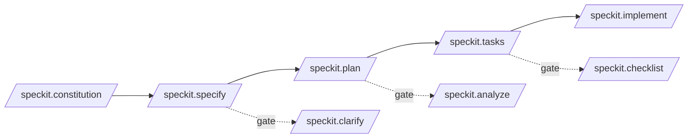
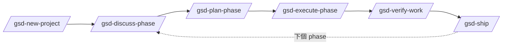
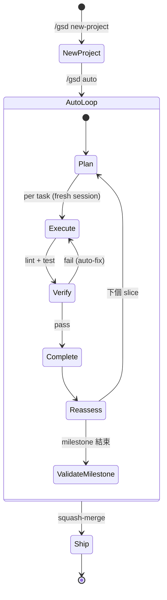
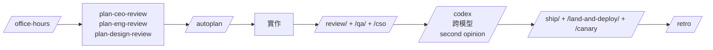
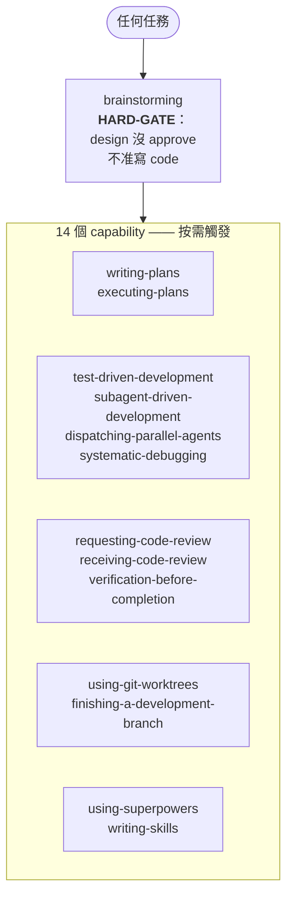
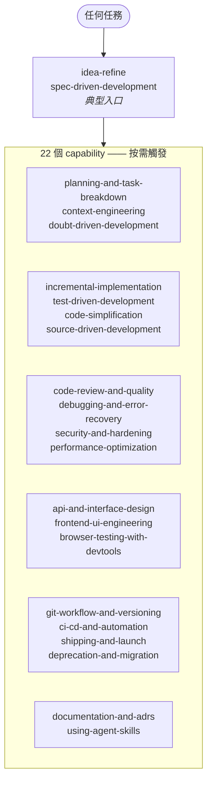
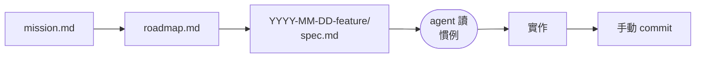

# Spec-Driven Development frameworks 與 agent harness — SDD 與 agent harness

!!! note "Terminology rule (zh-TW pages)"
    技術名詞首次出現以「中文 (English original)」格式呈現。**不自創翻譯**——
    若無公認譯名直接保留英文（如 `harness`、`SKILL.md`、`worktree`）。
    代碼、API 名、CLI flag、套件名、檔名一律不翻。

## 三層架構

這三件事常被混為一談，實際上不一樣：

| 層級 | 是什麼 | 範例 |
|---|---|---|
| **Skill** | 一個小的 `SKILL.md`（+ 可選 `references/`、`scripts/`），agent 按需載入。Stateless 的 prompt 片段。受 [Agent Skills spec](https://agentskills.io/specification) 規範。 | 本 repo 的 skills、`mattpocock/skills`、`anthropics/skills`、`gstack` skills |
| **SDD framework** | 擁有「需求 → spec → 計劃 → 任務 → 執行 → 驗證」全流程的 workflow，通常用 slash command + 結構化 artifact。Stateful（會把 spec/plan/task 檔案寫進 repo）。 | [`github/spec-kit`](https://github.com/github/spec-kit)、[`gsd-build/get-shit-done`](https://github.com/gsd-build/get-shit-done) |
| **Agent harness** | 獨立的 CLI/runtime，**控制** agent session ——context window、fresh subagent、git worktree、crash recovery、cost tracking。是 wrap 或取代 agent 的程式。 | [`gsd-build/gsd-2`](https://github.com/gsd-build/gsd-2)、[OpenClaw](https://github.com/openclaw/openclaw)、[Pi SDK](https://github.com/badlogic/pi-mono) |

Skills 是**被** harness 跟 SDD framework 所**消費**的東西，不是它們的替代品。
本 repo 專注於 **skill** 這層，刻意**不**做 SDD framework 也不做 harness。
## 盤點：四個代表性專案

### `github/spec-kit` (95.5k ⭐) — SDD 的 reference implementation

事實上的 SDD framework，由 GitHub 維護。安裝一個 Python CLI（`specify`）
加上一組 slash command，把 spec/plan/task artifact 寫進你的 repo：

| Command | 產出 |
|---|---|
| `/speckit.constitution` | `.specify/memory/`——專案治理原則 |
| `/speckit.specify` | Feature spec（**what** 跟 **why**，不寫 stack） |
| `/speckit.plan` | 技術實作計劃（**how**） |
| `/speckit.tasks` | 可執行任務清單 |
| `/speckit.implement` | 執行任務 |
| `/speckit.clarify`, `/speckit.analyze`, `/speckit.checklist` | 可選品質 gate |

關鍵特性：

- **開放生態**——80+ 社群 extension（Jira/Linear sync、security review、
  V-Model、brownfield bootstrap、retro 等）+ preset 系統可在不改工具的
  情況下覆寫 template
- **支援 30+ agent**——Claude Code、Codex、Cursor、Copilot、Windsurf、
  Gemini CLI、Kilo 等
- **Skills mode**——`--integration <agent> --integration-options="--skills"`
  會把 slash command 改成 agent skill 安裝（`speckit-constitution` 等）
- **Stateless**——spec-kit 本身不管 agent session，只寫 prompt 檔讓 agent 執行

### `gsd-build/get-shit-done` (61.4k ⭐) — 給 solo builder 的精簡 SDD

由 TÂCHES 開發，較早期、較輕的同類產品。六個 command 的 loop：

```
/gsd-new-project → /gsd-discuss-phase → /gsd-plan-phase
  → /gsd-execute-phase → /gsd-verify-work → /gsd-ship
```

vs spec-kit 的差異：

- **少儀式**——明確為個人開發者設計，不是 50 人 eng org。沒有 story
  point、沒有 sprint sync
- **內建 subagent orchestration**——execute 階段平行跑多個 wave，每個
  wave 在自己的 fresh 200k-token context
- **持久 artifact**——`PROJECT.md` / `REQUIREMENTS.md` / `ROADMAP.md` /
  `STATE.md` / `CONTEXT.md` 跨 session 存活，每個新 agent 載入相同記憶
- 仍是**純 prompt framework**——靠 LLM 跟著 prompt 走，無法直接控制
  context 或 session lifecycle

### `gsd-build/gsd-2` (7.3k ⭐) — GSD 變成真正的 harness

承認 v1 prompt-framework 路線的硬限制（沒 context 控制、沒 crash
recovery、沒真正的自動化），把 GSD 用 [Pi SDK](https://github.com/badlogic/pi-mono)
重寫成獨立的 **TypeScript CLI**。是名副其實的 *agent harness*：

| v1 (prompt framework) | v2 (agent harness) |
|---|---|
| Claude Code 內的 slash command | 獨立 CLI |
| 靠 LLM 自己別把 context 塞滿 | 每個 task 一個 fresh session，programmatic |
| LLM self-loop 假裝 auto mode | SQLite database 上的 state machine |
| 無 crash recovery | Lock file + session forensics + DB-backed runtime state |
| 讓 LLM 自己寫 git command | Worktree 隔離、循序 commit、squash merge |
| 無 cost/token tracking | Per-unit ledger + dashboard + budget ceiling |
| 無 stuck detection | Sliding-window dispatch detector + 有界 retry |

階層：**Milestone → Slice → Task**，鐵則是 *一個 task 必須塞得進一個
context window*。`/gsd auto` 無人值守跑到 milestone 結束。

這跟 OpenClaw、gstack browser stack 是**同一個架構類別**——程式跑在
agent **外面**而不是 prompt 跑在 agent **裡面**。

### `Chen-Dixi/nano-bruce/specs` — 野生的最簡 SDD pattern

一個小型範例，展示 SDD 可以多輕：

```
specs/
├── mission.md
├── roadmap.md
├── tech-stack.md
├── 2026-04-24-configuration-system/
├── 2026-04-24-session-management/
└── 2026-05-03-terminal-ui/
```

只有三份 repo 級文件（mission / roadmap / tech-stack）+ 日期戳的 feature
spec 子目錄。沒有 CLI、沒有 slash command、沒有 harness——純粹是一套
agent 會讀的**慣例**。可以拿來看「SDD」剝掉工具後長什麼樣。
### `obra/superpowers` (186k ⭐) — methodology 包成 SKILL bundle

14 個 skill 把 SDD loop 拆成個別的 agent skill，而不是 slash command。
包含 `brainstorming`、`writing-plans`、`executing-plans`、
`test-driven-development`、`subagent-driven-development`、
`systematic-debugging`、`requesting-code-review`、
`receiving-code-review`、`verification-before-completion`、
`using-git-worktrees`、`finishing-a-development-branch`、
`dispatching-parallel-agents`、`using-superpowers`、`writing-skills`。

差異：

- **純 SKILL.md**——任何能載入 `SKILL.md` 的 agent 都能用（Claude Code、
  Codex、OpenCode、Cursor、Gemini CLI），不需要 CLI
- **HARD-GATE pattern**——每個 skill 都有「拒絕繼續」的硬規則（例如
  brainstorming 在你 approve design 前拒絕寫 code）
- **多平台 agent file**——`.claude-plugin/`、`.codex-plugin/`、
  `.cursor-plugin/`、`.opencode/`、`.gemini-extension`
- **methodology as plugin**——`/plugin install superpowers` 一次啟動全套

### `addyosmani/agent-skills` (39k ⭐) — Google 風格 SDLC 鷹架

22 個 SKILL.md 蓋整個 SDLC：`spec-driven-development`、
`planning-and-task-breakdown`、`incremental-implementation`、
`test-driven-development`、`code-review-and-quality`、
`debugging-and-error-recovery`、`documentation-and-adrs`、
`api-and-interface-design`、`frontend-ui-engineering`、
`browser-testing-with-devtools`、`ci-cd-and-automation`、
`deprecation-and-migration`、`git-workflow-and-versioning`、
`performance-optimization`、`security-and-hardening`、
`shipping-and-launch`、`context-engineering`、
`doubt-driven-development`、`idea-refine`、`code-simplification`、
`source-driven-development`、`using-agent-skills`。

差異：

- **更重的 SDLC 儀式**——明確的 ADR、安全 gate、deprecation 指南；適合
  比較大、有工程流程要求的 repo
- **每階段一個 skill**——比 spec-kit 的 slash command 更細
- **獨立 skill**——每個都能單獨呼叫，不強迫整套流程

## SDD 選項一覽

### 形態、主導權、artifact

| 專案 | ⭐ | 形態 | Loop 由誰主導 | 持久 artifact | 最適合誰 |
|---|---:|---|---|---|---|
| `github/spec-kit` | 96k | CLI + slash command | 全流程，社群最廣 | `.specify/` | 預設選項；要 plugin 生態 + 30+ agent 支援 |
| `gsd-build/get-shit-done` | 61k | Slash command | 全流程、少儀式 | `PROJECT.md` / `STATE.md` / `CONTEXT.md` | Solo builder、不要太多儀式 |
| `gsd-build/gsd-2` | 7k | 獨立 CLI (harness) | 全流程 + session 控制 | SQLite `.gsd/` | 要 context/session/cost 控制 + crash recovery |
| `obra/superpowers` | 186k | SKILL.md bundle | Capabilities，**沒有固定順序** | 每個 skill 自己的 artifact | 想在**任何** agent 拿 methodology、不依賴 CLI |
| `addyosmani/agent-skills` | 39k | SKILL.md bundle | Capabilities，**沒有固定順序** | ADRs、specs | 大 repo / 嚴格流程 / 要 ADR + security gate |
| `Chen-Dixi/nano-bruce` `specs/` | — | Markdown 慣例 | 無——agent 讀慣例 | `mission.md` / `roadmap.md` / 日期目錄 | 完全不要工具、只要 layout |

### Sequential workflows（有設計好的順序）

這四個 ship 明確的 command 序列，圖中順序是 README 規定的順序。

#### `github/spec-kit`——5 步主 loop + 3 個可選 gate



clarify / analyze / checklist 是**正交的品質 gate**，不是「步驟 6」。
spec 或 plan 需要 scrutiny 時才跑。

#### `gsd-build/get-shit-done` (v1)——6 步直線 loop，每個 phase 重複



#### `gsd-build/gsd-2`——`/gsd auto` 驅動的 state machine



幾乎全自動——人類觸發 `/gsd auto`，harness 從 SQLite state machine 驅動
全程，只在錯誤或 budget ceiling 才停。

#### `gstack`——7 階段 sprint，每階段一個專業角色



Think → Plan → Build → Review → Test → Ship → Reflect，每個角色一個專業 skill。

### Capability bundles（沒有固定順序）

這兩個裝的是**一袋 skill**，按需觸發。有入口 hard-gate，但其他都是
可以自由組合的 capability。

#### `obra/superpowers`——入口 gate + 14 個 capability



唯一強制順序：先 `brainstorming`。其他都是 agent 判斷適用時才呼叫。

#### `addyosmani/agent-skills`——22 個 SDLC capability



完全沒強制順序。22 個 skill 是 SDLC capability，agent 看 description
跟任務匹配時才載入。最接近「library」模型。

### Convention only（沒有 command、沒有 skill）

#### `Chen-Dixi/nano-bruce` `specs/` layout



純 markdown 慣例；沒 slash command、沒 skill、沒 harness。

### 只挑一個

**重要警告：** 同時 global 裝兩個 methodology bundle 會讓 agent 在
每步重新爭論流程。

- 四個 sequential workflow（spec-kit、GSD v1、GSD v2、gstack）在
  **專案層級互斥**——每個都預期自己擁有 slash-command 介面跟 artifact
  目錄
- 兩個 capability bundle（superpowers、addyosmani）**技術上可以**跟
  sequential workflow 共存，但實務上它們的入口 hard-gate 每個 task 都
  fire，會跟 sequential workflow 搶誰先 plan

挑*一個*主 methodology。本 repo 的個別 skill（grilling、TDD、diagnose、
retro、deep-research 等）拿來做**針對性補強**，不要當競爭的 methodology。

## 跟本 repo 的關係

cherry-pick 進來的 vendor skill 涵蓋 SDD loop 的**選定步驟**，但不綁
任何特定 framework 或 harness：

| SDD loop 步驟 | spec-kit primitive | gstack primitive | 本 repo 對應的 skill |
|---|---|---|---|
| Forcing-question 收集 | `/speckit.clarify` | `gstack-openclaw-office-hours` | `product-planning/gstack-openclaw-office-hours`、`engineering-fundamentals/grill-with-docs` |
| Strategic scope challenge | (社群 ext) | `gstack-openclaw-ceo-review` | `product-planning/gstack-openclaw-ceo-review` |
| 技術計劃 / PRD | `/speckit.plan` | `/plan-eng-review` | `engineering-fundamentals/to-prd` |
| Issue/task 拆解 | `/speckit.tasks` | (gstack auto) | `engineering-fundamentals/to-issues`、`engineering-fundamentals/triage` |
| 實作紀律 | `/speckit.implement` | `/ship` | `engineering-fundamentals/tdd` |
| Debugging | (社群 ext) | `gstack-openclaw-investigate`、`/investigate` | `product-planning/gstack-openclaw-investigate`、`engineering-fundamentals/diagnose` |
| 架構維護 | (社群 ext) | (n/a) | `engineering-fundamentals/improve-codebase-architecture`、`engineering-fundamentals/zoom-out` |
| Retrospective | (社群 ext) | `gstack-openclaw-retro`、`/retro` | `product-planning/gstack-openclaw-retro` |
| 專案記憶 | `.specify/memory/` constitution | `STATE.md` / `CONTEXT.md` | [`local/project-knowledge-harness`](../skills/project-knowledge-harness.zh-TW.md) |

典型用法是：

- 想用 SDD framework 的話自己挑一個（spec-kit 是安全預設、想少儀式選
  GSD v1、想要真 harness 選 GSD v2）
- 把本 repo 的 skill **同時**裝起來，補上你在意的特定 reasoning loop
  （grilling、TDD、diagnosis、project memory）

兩者**可以共存**。skill 是 stateless 的 prompt 片段，不會跟 spec-kit 的
`.specify/` artifact 或 GSD 的 `.planning/` / `.gsd/` database 打架。
## 該選哪個？

| 你想要… | 選 |
|---|---|
| 廣泛 agent 支援 + 社群生態的 spec/plan/task workflow | **spec-kit** |
| 同樣的 loop 但少儀式，給 solo builder | **GSD v1** |
| 真正控制 context、session、git worktree、cost、能從 crash 復原的 harness | **GSD v2** 或 **OpenClaw** |
| **最簡** SDD pattern，沒工具，只有 markdown 慣例 | **nano-bruce 風格的 `specs/`** layout |
| 鋒利、可組合的 reasoning skill（grill、TDD、diagnose、retro、CEO-review），可搭配上述任何一種 | **本 repo**（`engineering-fundamentals/` + `product-planning/`） |

## 本 repo **不會**做的事

記在這邊讓未來的 agent 不要再爭論：

- **不做 SDD framework**——spec-kit、GSD、BMAD、OpenSpec、Taskmaster 已
  經佔據這塊，做第 9 個沒意義
- **不做 harness**——GSD-2、OpenClaw、Pi SDK、claude-code-router 已經佔
  據這塊，agent runtime 基礎設施超出 scope
- **不對 SDD framework 選擇有意見**——本 repo 的 skill 應能跟 spec-kit、
  GSD v1/v2、或完全不用 framework 共存
## 延伸閱讀

- [Agent skill compatibility](agent-skill-compatibility.zh-TW.md)——本 repo
  跨 agent 採用的 portable `SKILL.md` baseline
- [`npx skills` metadata model](npx-skills-metadata.zh-TW.md)——install
  時 skill 怎麼被發現跟分組
- [Skill risk evaluations](skills-risk-evaluations.zh-TW.md)——什麼樣的
  workflow **不該**被做成 skill
